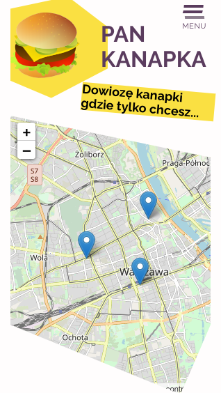

# Pan Kanapka 

---

Prosta aplikacja napisana w ramach nauki Django/Reacta. Znajomy rzucił pomysł i tak wpadłem w sidła **Pana Kanapki**... 😁
Poniżej przedstawiam pomysł na aplikację. Realizację widać w kodzie i pod adresem [https://pan-kanapka-front.herokuapp.com](https://pan-kanapka-front.herokuapp.com) .

---

Oto treść przekazana przez programistę - na zasadzie masz pomysł i się postaraj coś z tego zrobić...

> Może appka dla panów kanapka co przywożą żarcie do biur :) że możesz się zarejestrować na powiadomienia i jak pan kanapka powie że za 5 minut jest w konkretnym miejscu to dostajesz push notification ? :)
Można się pobawić z mapami (leaflet.js na przykład) rzeczami w okolicy geo (geodjango) i mobilkami (responsive design, HTML5 notifications, location) , do pchania powiadomień do ludzi pewbe jakaś kolejka zadań by się przydala
Imo bardzo rozwojowe zadanie, a przypadków użycia ma moze  5-6 więc niespecjalnie duża kobyła
Ale można zaczac od listy lokalizacji i osób zarejestrowanych na push notification. Wiec względnie  nieskomplikowany model danycb. I nie odrywa cię bardzo od frontendow, bo sporo frontu jest do napisania jednak

---
Początkowo wziąłem się za pisanie tego w czystym Django, ale stwierdziłem, że lepszym rozwiązaniem będzie podział projektu na część backendową i frontendową. Jako, że staram się też uczyć Reacta padło na tą bibliotekę. 

---

Poniżej przedstawiam technologie i narzędzia użyte do napisania opisywanej aplikacji: 🚀
## Backend

* Python
* Django
* Django-rest-framework

## Frontend

* html
* js (es6)
* css (sass, BEM)
* react
* redux
* pwa

## Wybrane biblioteki

* leaflet
* django-rest-auth
* django-push-notifiacations
* google places api

## Narzędzia z których korzystałem

* pycharm
* vs Code
* git
* figma
* heroku

Starałem się jak mogłem, żeby aplikacja została napisana zgodnie ze sztuką programistyczną. Wiem, że popełniłem masę błędów i kod nie jest idealny. Udało się jednak doprowadzić do tego, że ogólne założenie zostało spełnione i apka działa jak należy. Poniżej funkcjonalności, które na chwilę obecną zostały wprowadzone:

* Rejestracja/logowanie
* Z poziomu admina możliwość dodawania/usuwania lokalizacji
* Lokalizacje gdzie Pan Kanapka rozwozi jedzenie oznaczane są markerami na mapie
* Użytkownik po zalogowaniu może zezwolić przeglądarce na otrzymywanie powiadomień Push
* Admin (Pan Kanapka) może wysyłać powiadomienia, które trafiają na urządzenia zarejestrowanych użytkowników (tych, którzy wyrazili zgodę na otrzymywanie powiadomień i zapisali się na "subskrypcję" konkretnej lokalizacji)
---
Starałem się, żeby strona była wizualnie poprawna i przede wszystkim właściwie zakodowana (kontrast, semantyka, właściwe rozmieszczenie elementów na stronie). Jest responsywna, wygląda ok na wszelkiego typu urządzeniach (przynajmniej w moim testowym środowiku tak to wyglądało 😇). Jest to aplikacja PWA (Progressive Web App). 

Pisząc Pana Kanapkę napotkałem na wiele problemów, ale myślę, że wyszedłem z nich obronną ręką. Nauczyłem się naprawdę sporo, choć może *nauczyłem* to za dużo powiedziane. W moim odczuciu jeszcze długa droga przede mną, żeby opanować w zadowalającym stopniu technologie, których użyłem do zakodowania tej aplikacji. Frajdy było co nie miara i na pewno będzie jeszcze więcej, bo na liście mam jeszcze sporo rzeczy do poprawy/napisania. Także działam dalej... 👨‍💻

### Dla chętnych panel admina z jakże mało popularnym hasłem... :)

No dobra - panel nie do końca. Po prostu admin ma dodatkowo aktywne pole dodawania nowej lokalizacji (to w końcu Pan Kanapka) oraz wysyłania powiadomień... 

| Login        | Hasło          | Rodzaj konta  |
|:------------:|:--------------:|:-------------:|
| **admin**    | qwerty         | administrator |
| **test**     | Test12345      | użytkownik    |

Na koniec jeszcze link do kodu backendu (API napisane w django/django-rest-framework): [https://github.com/jundymek/pan-kanapka-api](https://github.com/jundymek/pan-kanapka-api)
